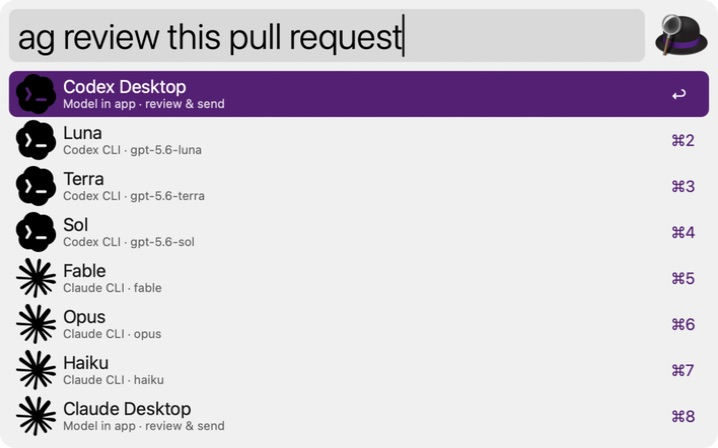

# Agent Launcher for Alfred

Route one Alfred prompt to Codex or Claude, in CLI or Desktop.



```text
ag investigate the flaky retry test

Luna            Codex CLI
Terra           Codex CLI
Sol             Codex CLI
Codex Desktop   Desktop, review before sending
Fable           Claude CLI
Opus            Claude CLI
Haiku           Claude CLI
Claude Desktop  Desktop Code, review before sending
```

## Features

- One prompt-first keyword, configurable and set to `ag` by default.
- Eight explicit launch targets with no routing syntax to remember.
- Provider marks make Codex and Claude rows immediately distinguishable.
- Command-Enter launches Fable from any selected row.
- Option-Enter opens Codex Desktop from any selected row.
- Optional shared CLI effort setting. Unsupported combinations ignore it.
- No API keys, prompt history, repository discovery, or workspace mutation.

CLI targets start the interactive agent with the prompt immediately. Desktop
targets prefill the composer and wait for you to review and send.

## Requirements

- macOS
- Alfred 5 with the Powerpack
- At least one supported app or CLI:
  - [Codex CLI or Desktop](https://developers.openai.com/codex/)
  - [Claude Code or Desktop](https://claude.ai/download)

Apple Terminal is used for CLI sessions. On first use, macOS may ask Alfred for
permission to control Terminal or System Events so the workflow can open a new
tab.

## Install

Download `Agent-Launcher.alfredworkflow` from the latest GitHub release and
open it. Alfred shows the Workflow Configuration screen during import.

Configuration:

- **Keyword:** defaults to `ag`.
- **Default CLI effort:** defaults to the model's own setting. Codex accepts
  `minimal` through `xhigh`; Claude accepts model-dependent levels through
  `max`. Desktop targets and Haiku ignore this setting.

## Build and test

The workflow has no third-party runtime dependencies.

```bash
./scripts/test.sh
./scripts/build.sh
```

The package and SHA-256 checksum are written to `dist/`.

## Privacy and safety

Prompts stay on your Mac until the selected official CLI or Desktop app handles
them. The workflow does not collect analytics, store prompts, or bypass agent
permission settings. CLI prompts are shell-quoted before Terminal receives
them; Desktop prompts are URL-encoded.

## Status

This is an unofficial community project by
[Combinatrix.ai](https://combinatrix.ai/). It is not affiliated with or
endorsed by OpenAI, Anthropic, or Alfred. Codex, Claude, and Alfred are
trademarks of their respective owners.

Provider mark vectors are sourced from
[Lobe Icons](https://github.com/lobehub/lobe-icons), a community-maintained,
MIT-licensed collection rather than an official provider distribution. The
marks are used only to identify their respective products and remain the
property of their trademark owners. See [THIRD_PARTY_NOTICES.md](THIRD_PARTY_NOTICES.md).

## License

[MIT](LICENSE)
